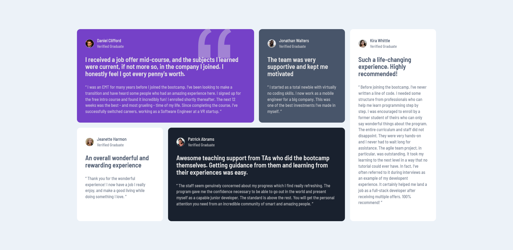

# Frontend Mentor - Order summary card solution

This is a solution to the [Testimonials grid section challenge on Frontend Mentor](https://www.frontendmentor.io/challenges/testimonials-grid-section-Nnw6J7Un7). Frontend Mentor challenges help you improve your coding skills by building realistic projects.

## Table of contents

- [Overview](#overview)
  - [The challenge](#the-challenge)
  - [Screenshot](#screenshot)
  - [Links](#links)
- [My process](#my-process)
  - [Built with](#built-with)
  - [What I learned](#what-i-learned)
  - [Useful resources](#useful-resources)
- [Author](#author)

## Overview

### The challenge

Users should be able to:

- View the optimal layout for the site depending on their device's screen size

### Screenshot

### Links

- Solution URL: [Frontend Mentor Solution](https://www.frontendmentor.io/solutions/testimonials-grid-section-with-html-css-and-sass-Iha6bhjMUP)
- Live Site URL: [Testimonials Grid Section](https://drangam9.github.io/testimonials-grid-section/)

## My process

### Built with

- Semantic HTML5 markup
- CSS custom properties
- CSS Grid
- Sass
- Mobile-first workflow

### What I learned

This project taught me about CSS grids, layout, responsive design and that I don't need to use flex for every single thing 🥲 .

### Useful resources

- [Media query](https://www.w3schools.com/css/css_rwd_mediaqueries.asp) - This W3Schools lesson helped me with the mobile design

## Author

- Github - [drangam9](https://githhub.com/drangam9)
- Frontend Mentor - [@drangam9](https://www.frontendmentor.io/profile/drangam9)
